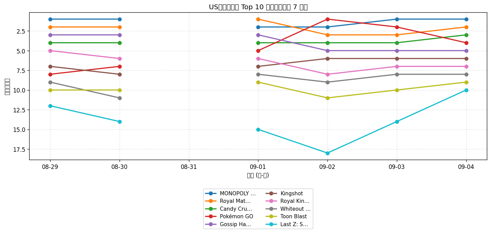
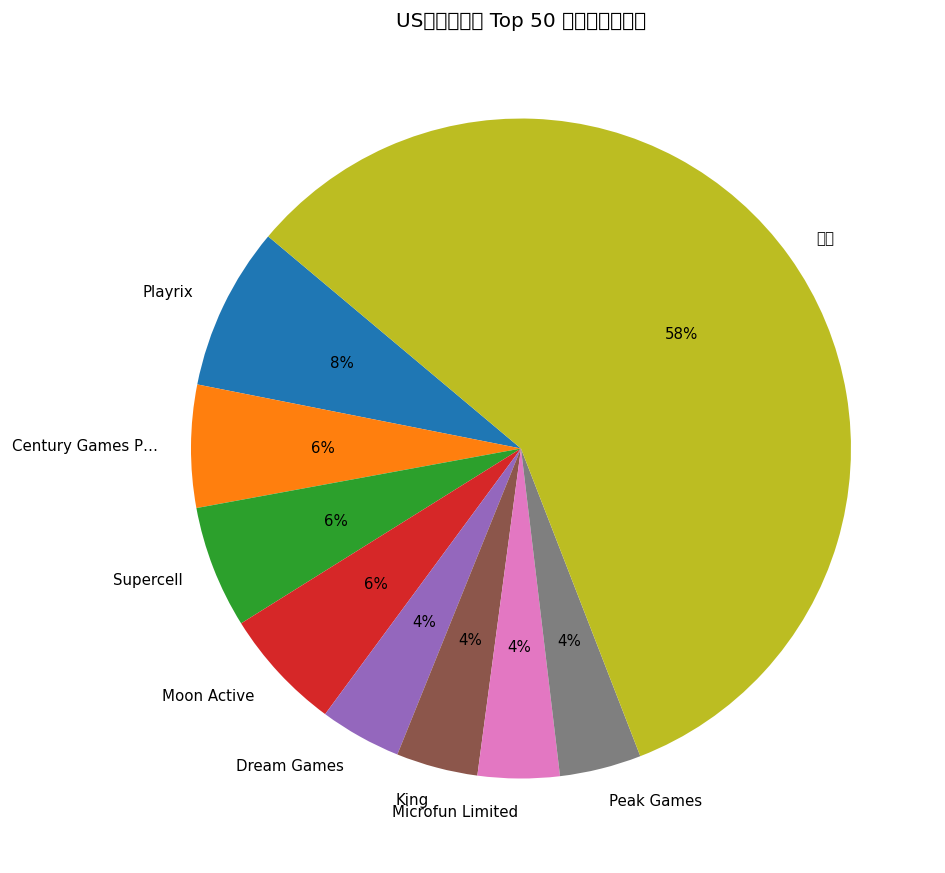
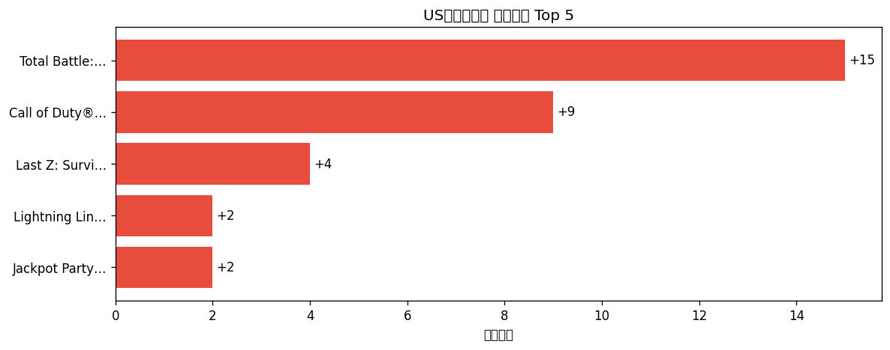

# 📊 游戏榜单日报 - 2026-09-04

**市场**：US　**榜单**：畅销游戏榜

## 📈 Top 10 排名趋势（近 6 天）

## 🏢 开发者席位占比

## 今日 Top 50

| 游戏榜排名 | 总榜排名 | 应用名称 | 开发者 |
| --- | --- | --- | --- |
| 1 | 5 | MONOPOLY GO! | Scopely, Inc. |
| 2 | 12 | Royal Match | Dream Games |
| 3 | 14 | Candy Crush Saga | King |
| 4 | 15 | Pokémon GO | Scopely Explore, Inc. |
| 5 | 18 | Gossip Harbor®: Merge & Story | Microfun Limited |
| 6 | 24 | Kingshot | Century Games Pte. Ltd. |
| 7 | 25 | Royal Kingdom | Dream Games |
| 8 | 27 | Whiteout Survival | Century Games Pte. Ltd. |
| 9 | 33 | Toon Blast | Peak Games |
| 10 | 34 | Last Z: Survival Shooter | Omnilojo Pte Ltd |
| 11 | 36 | Last War:Survival | FUNFLY PTE. LTD. |
| 12 | 39 | Tasty Travels: Merge Game | Century Games Pte. Ltd. |
| 13 | 42 | Township | Playrix |
| 14 | 43 | Clash of Clans | Supercell |
| 15 | 46 | Match Factory! | Peak Games |
| 16 | 48 | Gardenscapes | Playrix |
| 17 | 51 | NYT Games: Wordle & Crossword | The New York Times Company |
| 18 | 56 | Pixel Flow! | Loom Games Oyun Yazilim ve Pazarlama Anonim Sirketi |
| 19 | 57 | Free Fire: 9th Anniversary | GARENA INTERNATIONAL I PRIVATE LIMITED |
| 20 | 58 | Total Battle: War Strategy | Scorewarrior |
| 21 | 59 | Coin Master | Moon Active |
| 22 | 62 | Brawl Stars | Supercell |
| 23 | 63 | Block Out! - Color Sort Puzzle | Grand Games A.Ş. |
| 24 | 71 | Homescapes: Match 3 Games | Playrix |
| 25 | 73 | Lightning Link Casino Slots | Product Madness |
| 26 | 76 | Fishdom | Playrix |
| 27 | 77 | Jelly Busters: Puzzle Game | Moon Active |
| 28 | 78 | Merge Cooking® | Happibits |
| 29 | 81 | Evony | TOP GAMES INC. |
| 30 | 83 | Jackpot Party - Casino Slots | Phantom EFX, Inc. |
| 31 | 85 | Magic Sort! | Grand Games A.Ş. |
| 32 | 87 | Call of Duty®: Mobile | Activision Publishing, Inc. |
| 33 | 88 | Screwdom | Zego Global Pte Ltd |
| 34 | 94 | DRAGON BALL Z DOKKAN BATTLE | Bandai Namco Entertainment Inc. |
| 35 | 96 | Hay Day | Supercell |
| 36 | 98 | Cashman Casino Slots Games | Product Madness |
| 37 | - | Pokémon TCG Pocket | The Pokemon Company |
| 38 | - | All in Hole: Black Hole Games | HOMA GAMES |
| 39 | - | Disney Solitaire | SuperPlay |
| 40 | - | Flambé®: Merge and Cook | Microfun Limited |
| 41 | - | Yarn Loop: Knit Puzzle | Combo Games |
| 42 | - | Sword x Staff | Boltray Games |
| 43 | - | Candy Crush Soda Saga | King |
| 44 | - | Solitaire Associations Journey | Hitapps Games LTD |
| 45 | - | Dark War:Survival | Omnilojo Pte Ltd |
| 46 | - | EA SPORTS FC Soccer Mobile 26 | Electronic Arts |
| 47 | - | Age of Origins:Tower Defense | Hong Kong Ke Mo software Co., Limited |
| 48 | - | Game of Thrones: Dragonfire | Warner Bros. |
| 49 | - | Travel Town - Merge Adventure | Moon Active |
| 50 | - | Color Block Jam | Rollic Games |

## 🔥 上升最快 Top 5

| 应用名称 | 游戏榜变化 | 今日游戏榜排名 |
| --- | --- | --- |
| Total Battle: War Strategy | ↑15 (#35→#20) | #20 |
| Call of Duty®: Mobile | ↑9 (#41→#32) | #32 |
| Last Z: Survival Shooter | ↑4 (#14→#10) | #10 |
| Lightning Link Casino Slots | ↑2 (#27→#25) | #25 |
| Jackpot Party - Casino Slots | ↑2 (#32→#30) | #30 |

## 🆕 新入榜 Top 5

| 应用名称 | 游戏榜排名 | 总榜排名 | 开发者 |
| --- | --- | --- | --- |
| Brawl Stars | #22 | 62 | Supercell |
| Game of Thrones: Dragonfire | #48 | - | Warner Bros. |

## 📝 运营小结

今日US畅销游戏榜游戏榜由「MONOPOLY GO!」领跑（总榜 #5），「Total Battle: War Strategy」游戏榜上升 15 位（#35 → #20），值得关注；新入榜游戏包括 Brawl Stars、Game of Thrones: Dragonfire 等，建议持续跟踪后续表现。
