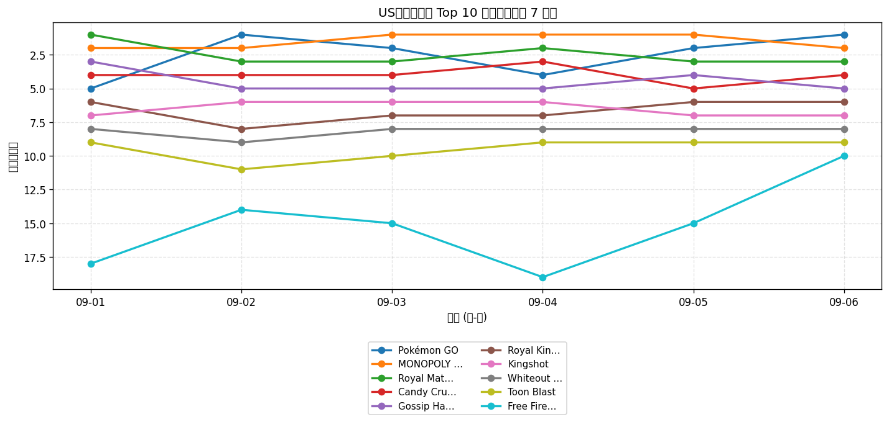
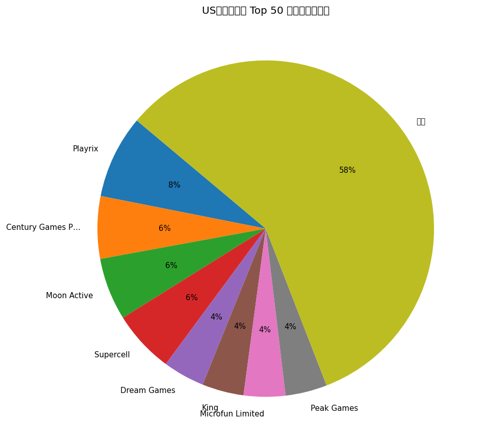
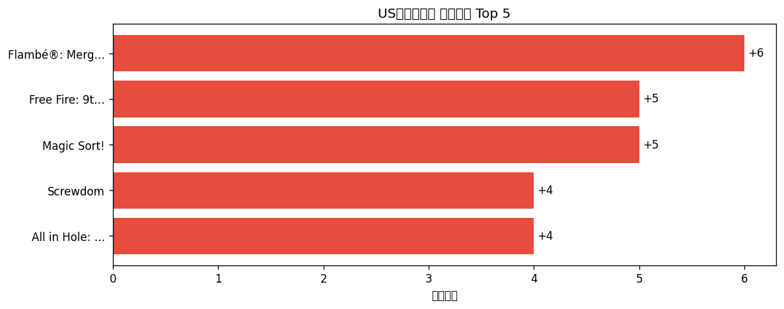

# 📊 游戏榜单日报 - 2026-09-06

**市场**：US　**榜单**：畅销游戏榜

## 📈 Top 10 排名趋势（近 7 天）

## 🏢 开发者席位占比

## 今日 Top 50

| 游戏榜排名 | 总榜排名 | 应用名称 | 开发者 |
| --- | --- | --- | --- |
| 1 | 3 | Pokémon GO | Scopely Explore, Inc. |
| 2 | 4 | MONOPOLY GO! | Scopely, Inc. |
| 3 | 9 | Royal Match | Dream Games |
| 4 | 12 | Candy Crush Saga | King |
| 5 | 15 | Gossip Harbor®: Merge & Story | Microfun Limited |
| 6 | 24 | Royal Kingdom | Dream Games |
| 7 | 25 | Kingshot | Century Games Pte. Ltd. |
| 8 | 28 | Whiteout Survival | Century Games Pte. Ltd. |
| 9 | 32 | Toon Blast | Peak Games |
| 10 | 34 | Free Fire: 9th Anniversary | GARENA INTERNATIONAL I PRIVATE LIMITED |
| 11 | 35 | Evony | TOP GAMES INC. |
| 12 | 38 | Tasty Travels: Merge Game | Century Games Pte. Ltd. |
| 13 | 39 | Township | Playrix |
| 14 | 43 | Last War:Survival | FUNFLY PTE. LTD. |
| 15 | 44 | Match Factory! | Peak Games |
| 16 | 45 | Last Z: Survival Shooter | Omnilojo Pte Ltd |
| 17 | 49 | Gardenscapes | Playrix |
| 18 | 50 | Coin Master | Moon Active |
| 19 | 51 | Pixel Flow! | Loom Games Oyun Yazilim ve Pazarlama Anonim Sirketi |
| 20 | 59 | Homescapes: Match 3 Games | Playrix |
| 21 | 61 | Block Out! - Color Sort Puzzle | Grand Games A.Ş. |
| 22 | 66 | Total Battle: War Strategy | Scorewarrior |
| 23 | 67 | Clash of Clans | Supercell |
| 24 | 68 | Jackpot Party - Casino Slots | Phantom EFX, Inc. |
| 25 | 74 | Fishdom | Playrix |
| 26 | 75 | Magic Sort! | Grand Games A.Ş. |
| 27 | 79 | Lightning Link Casino Slots | Product Madness |
| 28 | 80 | Jelly Busters: Puzzle Game | Moon Active |
| 29 | 81 | Screwdom | Zego Global Pte Ltd |
| 30 | 82 | Call of Duty®: Mobile | Activision Publishing, Inc. |
| 31 | 83 | Merge Cooking® | Happibits |
| 32 | 87 | Cashman Casino Slots Games | Product Madness |
| 33 | 96 | NYT Games: Wordle & Crossword | The New York Times Company |
| 34 | 98 | All in Hole: Black Hole Games | HOMA GAMES |
| 35 | 100 | Candy Crush Soda Saga | King |
| 36 | - | Travel Town - Merge Adventure | Moon Active |
| 37 | - | Disney Solitaire | SuperPlay |
| 38 | - | Free Fire MAX | GARENA INTERNATIONAL I PRIVATE LIMITED |
| 39 | - | Flambé®: Merge and Cook | Microfun Limited |
| 40 | - | Pokémon TCG Pocket | The Pokemon Company |
| 41 | - | Yarn Loop: Knit Puzzle | Combo Games |
| 42 | - | Brawl Stars | Supercell |
| 43 | - | Solitaire Associations Journey | Hitapps Games LTD |
| 44 | - | EA SPORTS FC Soccer Mobile 26 | Electronic Arts |
| 45 | - | Sword x Staff | Boltray Games |
| 46 | - | Quick Hit Casino - Vegas Slots | Appchi Media Ltd |
| 47 | - | DRAGON BALL Z DOKKAN BATTLE | Bandai Namco Entertainment Inc. |
| 48 | - | Dark War:Survival | Omnilojo Pte Ltd |
| 49 | - | Hay Day | Supercell |
| 50 | - | Colony Flow! | ABI GLOBAL LTD. |

## 🔥 上升最快 Top 5

| 应用名称 | 游戏榜变化 | 今日游戏榜排名 |
| --- | --- | --- |
| Flambé®: Merge and Cook | ↑6 (#45→#39) | #39 |
| Free Fire: 9th Anniversary | ↑5 (#15→#10) | #10 |
| Magic Sort! | ↑5 (#31→#26) | #26 |
| Screwdom | ↑4 (#33→#29) | #29 |
| All in Hole: Black Hole Games | ↑4 (#38→#34) | #34 |

## 🆕 新入榜 Top 5

| 应用名称 | 游戏榜排名 | 总榜排名 | 开发者 |
| --- | --- | --- | --- |
| Free Fire MAX | #38 | - | GARENA INTERNATIONAL I PRIVATE LIMITED |
| EA SPORTS FC Soccer Mobile 26 | #44 | - | Electronic Arts |
| Colony Flow! | #50 | - | ABI GLOBAL LTD. |

## 📝 运营小结

今日US畅销游戏榜游戏榜由「Pokémon GO」领跑（总榜 #3），「Flambé®: Merge and Cook」游戏榜上升 6 位（#45 → #39），值得关注；新入榜游戏包括 Free Fire MAX、EA SPORTS FC Soccer Mobile 26、Colony Flow! 等，建议持续跟踪后续表现。
