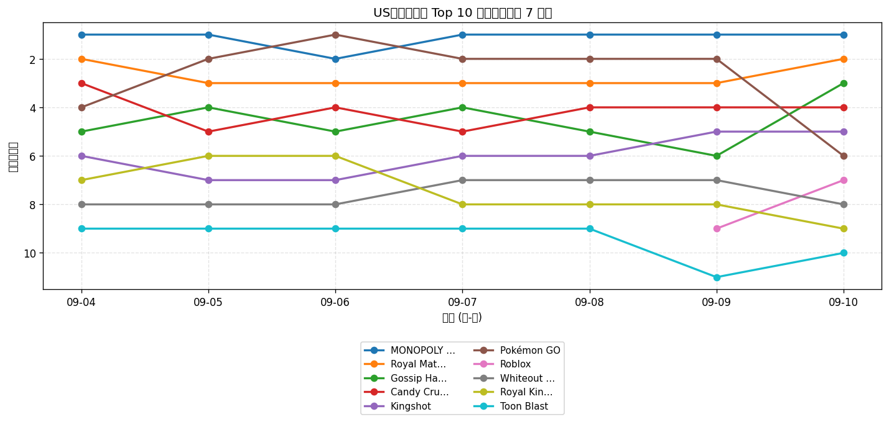
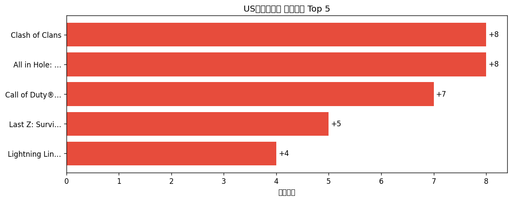

# 📊 游戏榜单日报 - 2026-09-10

**市场**：US　**榜单**：畅销游戏榜

## 📈 Top 10 排名趋势（近 7 天）

## 🏢 开发者席位占比

## 今日 Top 50

| 游戏榜排名 | 总榜排名 | 应用名称 | 开发者 |
| --- | --- | --- | --- |
| 1 | 8 | MONOPOLY GO! | Scopely, Inc. |
| 2 | 13 | Royal Match | Dream Games |
| 3 | 14 | Gossip Harbor®: Merge & Story | Microfun Limited |
| 4 | 15 | Candy Crush Saga | King |
| 5 | 16 | Kingshot | Century Games Pte. Ltd. |
| 6 | 20 | Pokémon GO | Scopely Explore, Inc. |
| 7 | 22 | Roblox | Roblox Corporation |
| 8 | 23 | Whiteout Survival | Century Games Pte. Ltd. |
| 9 | 34 | Royal Kingdom | Dream Games |
| 10 | 39 | Toon Blast | Peak Games |
| 11 | 41 | Last War:Survival | FUNFLY PTE. LTD. |
| 12 | 49 | Township | Playrix |
| 13 | 50 | Match Factory! | Peak Games |
| 14 | 51 | Last Z: Survival Shooter | Omnilojo Pte Ltd |
| 15 | 52 | Tasty Travels: Merge Game | Century Games Pte. Ltd. |
| 16 | 58 | Gardenscapes | Playrix |
| 17 | 60 | Free Fire: 9th Anniversary | GARENA INTERNATIONAL I PRIVATE LIMITED |
| 18 | 61 | Pixel Flow! | Loom Games Oyun Yazilim ve Pazarlama Anonim Sirketi |
| 19 | 66 | Block Out! - Color Sort Puzzle | Grand Games A.Ş. |
| 20 | 70 | Coin Master | Moon Active |
| 21 | 71 | DRAGON BALL LEGENDS | Bandai Namco Entertainment Inc. |
| 22 | 73 | Jelly Busters: Puzzle Game | Moon Active |
| 23 | 74 | Clash Royale | Supercell |
| 24 | 78 | Homescapes: Match 3 Games | Playrix |
| 25 | 79 | Clash of Clans | Supercell |
| 26 | 87 | Lightning Link Casino Slots | Product Madness |
| 27 | 89 | Screwdom | Zego Global Pte Ltd |
| 28 | 90 | Fishdom | Playrix |
| 29 | 91 | Merge Cooking® | Happibits |
| 30 | 93 | NYT Games: Wordle & Crossword | The New York Times Company |
| 31 | 94 | Magic Sort! | Grand Games A.Ş. |
| 32 | 97 | Call of Duty®: Mobile | Activision Publishing, Inc. |
| 33 | 98 | Jackpot Party - Casino Slots | Phantom EFX, Inc. |
| 34 | 100 | Evony | TOP GAMES INC. |
| 35 | - | Total Battle: War Strategy | Scorewarrior |
| 36 | - | All in Hole: Black Hole Games | HOMA GAMES |
| 37 | - | Sword x Staff | Boltray Games |
| 38 | - | Cashman Casino Slots Games | Product Madness |
| 39 | - | Colony Flow! | ABI GLOBAL LTD. |
| 40 | - | Yarn Loop: Knit Puzzle | Combo Games |
| 41 | - | Flambé®: Merge and Cook | Microfun Limited |
| 42 | - | Dark War:Survival | Omnilojo Pte Ltd |
| 43 | - | Solitaire Associations Journey | Hitapps Games LTD |
| 44 | - | Candy Crush Soda Saga | King |
| 45 | - | Disney Solitaire | SuperPlay |
| 46 | - | Bus Traffic Fever! | GOODROID,Inc. |
| 47 | - | Color Block Jam | Rollic Games |
| 48 | - | Marvel Contest of Champions | Kabam Games, Inc. |
| 49 | - | Travel Town - Merge Adventure | Moon Active |
| 50 | - | Quick Hit Casino - Vegas Slots | Appchi Media Ltd |

## 🔥 上升最快 Top 5

| 应用名称 | 游戏榜变化 | 今日游戏榜排名 |
| --- | --- | --- |
| Clash of Clans | ↑8 (#33→#25) | #25 |
| All in Hole: Black Hole Games | ↑8 (#44→#36) | #36 |
| Call of Duty®: Mobile | ↑7 (#39→#32) | #32 |
| Last Z: Survival Shooter | ↑5 (#19→#14) | #14 |
| Lightning Link Casino Slots | ↑4 (#30→#26) | #26 |

## 🆕 新入榜 Top 5

| 应用名称 | 游戏榜排名 | 总榜排名 | 开发者 |
| --- | --- | --- | --- |
| DRAGON BALL LEGENDS | #21 | 71 | Bandai Namco Entertainment Inc. |
| Marvel Contest of Champions | #48 | - | Kabam Games, Inc. |
| Quick Hit Casino - Vegas Slots | #50 | - | Appchi Media Ltd |

## 📝 运营小结

今日US畅销游戏榜游戏榜由「MONOPOLY GO!」领跑（总榜 #8），「Clash of Clans」游戏榜上升 8 位（#33 → #25），值得关注；新入榜游戏包括 DRAGON BALL LEGENDS、Marvel Contest of Champions、Quick Hit Casino - Vegas Slots 等，建议持续跟踪后续表现。
