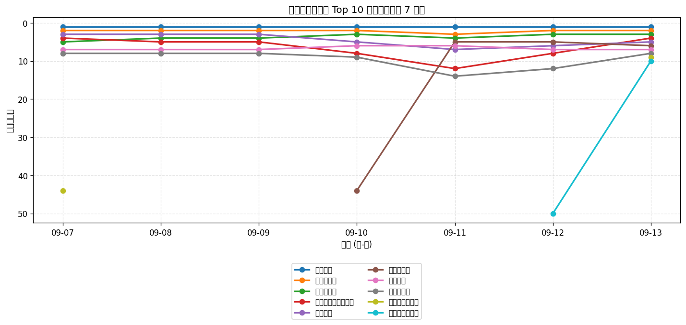
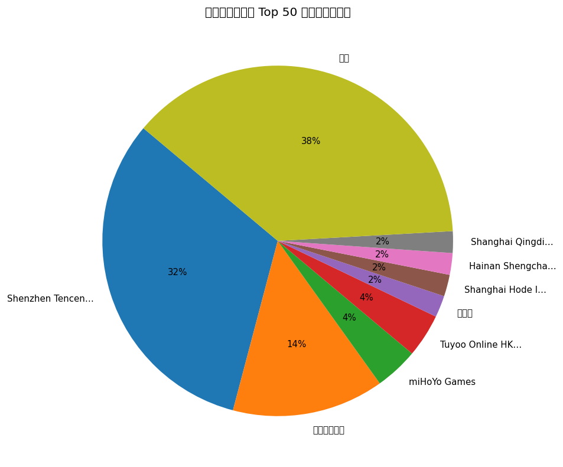
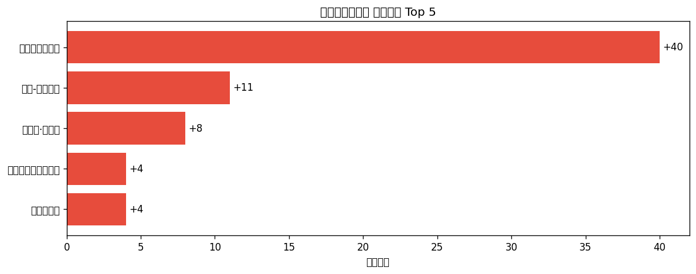

# 📊 游戏榜单日报 - 2026-09-13

**市场**：中国　**榜单**：畅销游戏榜

## 📈 Top 10 排名趋势（近 7 天）

## 🏢 开发者席位占比

## 今日 Top 50

| 游戏榜排名 | 总榜排名 | 应用名称 | 开发者 |
| --- | --- | --- | --- |
| 1 | 1 | 王者荣耀 | Shenzhen Tencent Tianyou Technology Ltd |
| 2 | 8 | 三角洲行动 | Shenzhen Tencent Tianyou Technology Ltd |
| 3 | 12 | 金铲铲之战 | Shenzhen Tencent Tianyou Technology Ltd |
| 4 | 14 | 无畏契约：源能行动 | Shenzhen Tencent Tianyou Technology Ltd |
| 5 | 15 | 和平精英 | Shenzhen Tencent Tianyou Technology Ltd |
| 6 | 16 | 王者万象棋 | Shenzhen Tencent Tianyou Technology Ltd |
| 7 | 18 | 梦幻西游 | 网易移动游戏 |
| 8 | 20 | 开心消消乐 | 乐元素 |
| 9 | 22 | 三国：谋定天下 | Shanghai Hode Information Technology Co.,Ltd. |
| 10 | 24 | 崩坏：星穹铁道 | miHoYo Games |
| 11 | 25 | 向僵尸开炮-尸潮来袭 | Hainan Shengchang Network Technology Co., Ltd. |
| 12 | 26 | 洛克王国：世界 | Shenzhen Tencent Tianyou Technology Ltd |
| 13 | 27 | 火影忍者 | Shenzhen Tencent Tianyou Technology Ltd |
| 14 | 28 | 阴阳师 - 十周年送十连十金 | 网易移动游戏 |
| 15 | 30 | 无尽冬日 | Shanghai Qingdi Technology Company Limited |
| 16 | 31 | 捕鱼大作战-街机打鱼游戏王者 | Tuyoo Online HK Limited |
| 17 | 33 | FC足球世界-Next | Tencent Mobile Games |
| 18 | 36 | 蛋仔派对 | 网易移动游戏 |
| 19 | 37 | 第五人格 | 网易移动游戏 |
| 20 | 40 | 腾讯欢乐斗地主 | Shenzhen Tencent Tianyou Technology Ltd |
| 21 | 42 | 三国：冰河时代 | EVISTA PTE. LTD. |
| 22 | 43 | 塔塔冒险队 | 上海莉莉丝计算机 |
| 23 | 44 | 三国志·战略版 | Lingxi Games Inc. |
| 24 | 45 | 捕鱼大咖-畅爽3D街机捕鱼游戏 | 游酷盛世科技(北京)有限公司 |
| 25 | 48 | 超自然行动组-登录送高泰明 | 巨人网络科技有限公司 |
| 26 | 50 | 英雄联盟手游 | Shenzhen Tencent Tianyou Technology Ltd |
| 27 | 51 | 时尚百货城 | 深圳市爱的番茄科技有限公司 |
| 28 | 52 | 指尖四川麻将 | Shenzhen Zen-Game Technology CO.,LTD |
| 29 | 57 | 实况足球 | 网易移动游戏 |
| 30 | 58 | 使命召唤手游 | Shenzhen Tencent Tianyou Technology Ltd |
| 31 | 61 | 鱼乐达人-王者捕鱼电玩街机打鱼游戏 | CoolPlus Software (HongKong) Limited |
| 32 | 64 | 途游休闲捕鱼-百万倍街机王者大作战 | TYSG Games |
| 33 | 65 | 率土之滨 | 网易移动游戏 |
| 34 | 66 | 多乐够级 | Beijing Pengqu Technology Co.,Ltd. |
| 35 | 67 | QQ飞车 | Shenzhen Tencent Tianyou Technology Ltd |
| 36 | 68 | 原神-至冬开放 | miHoYo Games |
| 37 | 70 | 部落冲突（Clash of Clans） | Shenzhen Tencent Tianyou Technology Ltd |
| 38 | 72 | QQ炫舞 | Shenzhen Tencent Tianyou Technology Ltd |
| 39 | 73 | 永远的蔚蓝星球-周杰伦代言 | Songyue Joy |
| 40 | 74 | 疯狂水世界 | 益世界网络科技(上海)有限公司 |
| 41 | 75 | 途游斗地主（比赛版） | Tuyoo Online HK Limited |
| 42 | 78 | 明日方舟 | Shanghai Hypergryph Network Technology Co., Ltd. |
| 43 | 79 | 三国杀 | 杭州游卡网络技术有限公司 |
| 44 | 80 | 奔奔王国 | Fuzhou Dian Dian Song He Technology Co., Ltd |
| 45 | 81 | 最佳球会-全新赛季版本 | Gala Sports Technology Limited |
| 46 | 82 | 我的花园世界 | 厦门麟贝互娱科技有限公司 |
| 47 | 83 | 穿越火线-枪战王者 | Shenzhen Tencent Tianyou Technology Ltd |
| 48 | 85 | 梦幻花园 - Gardenscapes | Beijing Wei Wo Le Yuan Information and Technology Co., Ltd |
| 49 | 86 | 暗区突围 | Shenzhen Tencent Tianyou Technology Ltd |
| 50 | 87 | 光·遇 | 网易移动游戏 |

## 🔥 上升最快 Top 5

| 应用名称 | 游戏榜变化 | 今日游戏榜排名 |
| --- | --- | --- |
| 崩坏：星穹铁道 | ↑40 (#50→#10) | #10 |
| 原神-至冬开放 | ↑11 (#47→#36) | #36 |
| 三国志·战略版 | ↑8 (#31→#23) | #23 |
| 无畏契约：源能行动 | ↑4 (#8→#4) | #4 |
| 开心消消乐 | ↑4 (#12→#8) | #8 |

## 🆕 新入榜 Top 5

| 应用名称 | 游戏榜排名 | 总榜排名 | 开发者 |
| --- | --- | --- | --- |
| 三国：谋定天下 | #9 | 22 | Shanghai Hode Information Technology Co.,Ltd. |
| 暗区突围 | #49 | 86 | Shenzhen Tencent Tianyou Technology Ltd |
| 光·遇 | #50 | 87 | 网易移动游戏 |

## 📝 运营小结

今日中国畅销游戏榜游戏榜由「王者荣耀」领跑（总榜 #1），「崩坏：星穹铁道」游戏榜上升 40 位（#50 → #10），值得关注；新入榜游戏包括 三国：谋定天下、暗区突围、光·遇 等，建议持续跟踪后续表现。
