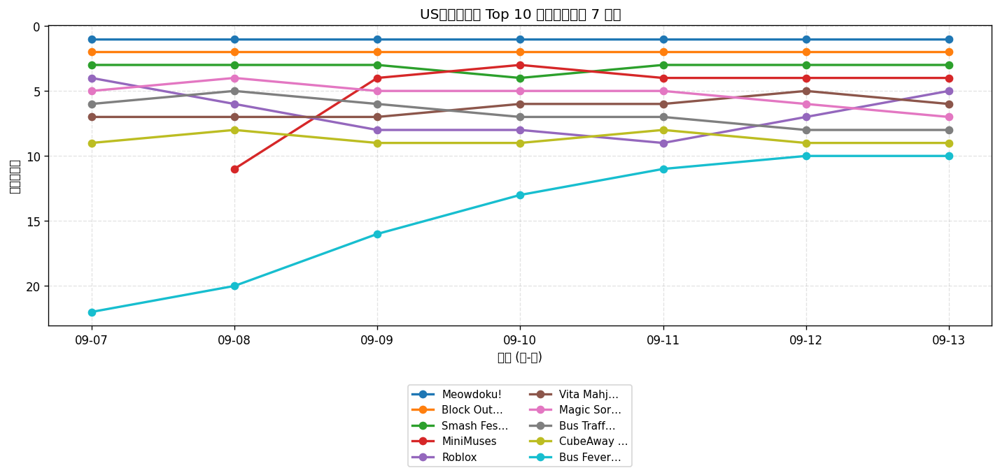
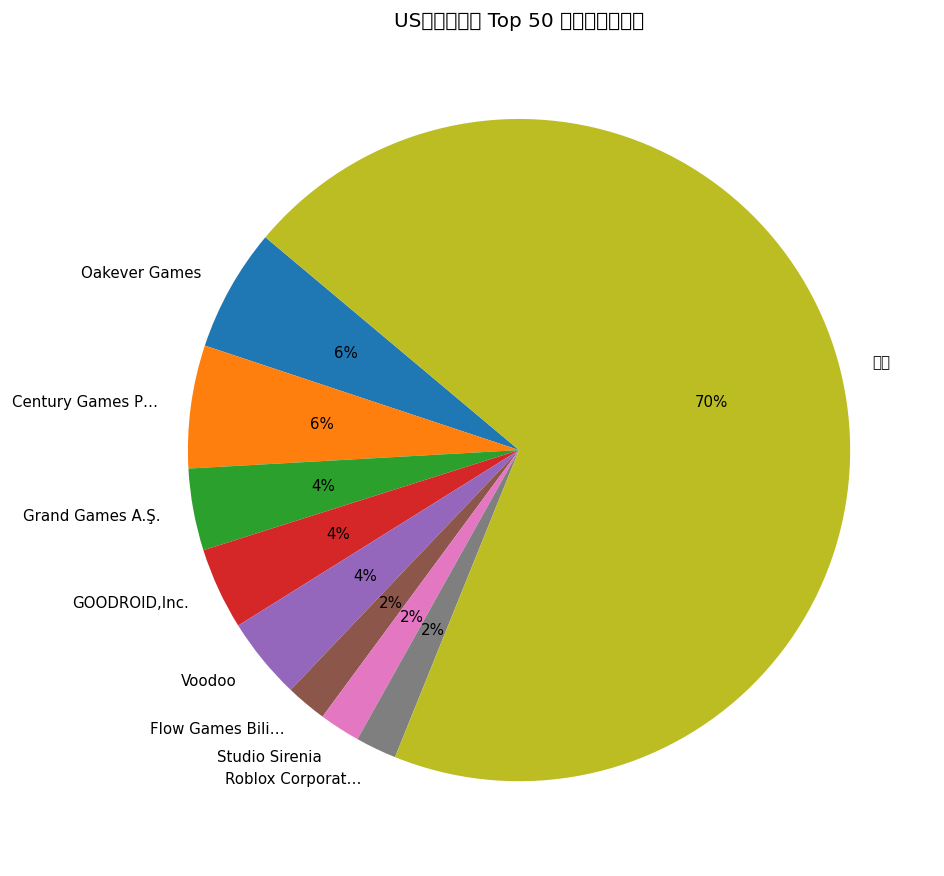
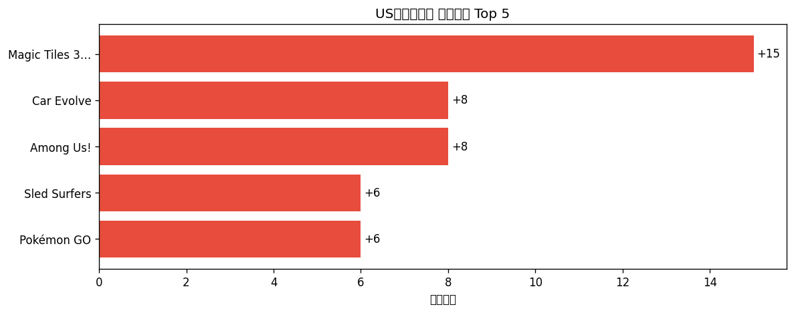

# 📊 游戏榜单日报 - 2026-09-13

**市场**：US　**榜单**：免费游戏榜

## 📈 Top 10 排名趋势（近 7 天）

## 🏢 开发者席位占比

## 今日 Top 50

| 游戏榜排名 | 总榜排名 | 应用名称 | 开发者 |
| --- | --- | --- | --- |
| 1 | - | Meowdoku! | Oakever Games |
| 2 | - | Block Out! - Color Sort Puzzle | Grand Games A.Ş. |
| 3 | - | Smash Fest! | Flow Games Bilisim Yazilim ve Pazarlama Anonim Sirketi |
| 4 | - | MiniMuses | Studio Sirenia |
| 5 | - | Roblox | Roblox Corporation |
| 6 | - | Vita Mahjong | Vita Studio |
| 7 | - | Magic Sort! | Grand Games A.Ş. |
| 8 | - | Bus Traffic Fever! | GOODROID,Inc. |
| 9 | - | CubeAway - 3DPuzzle | GOODROID,Inc. |
| 10 | - | Bus Fever Party! | Lumi Games |
| 11 | - | Block Blast！ | Hungry Studio |
| 12 | - | Colony Flow! | ABI GLOBAL LTD. |
| 13 | - | Car Evolve | Heseri Games Inc |
| 14 | - | Amaze GO! | Oakever Games |
| 15 | - | Royal Smash! - Physics Puzzle | Cypher Games |
| 16 | - | EA College Football Mobile 27 | Electronic Arts |
| 17 | - | 82-0.com | Vaulty Studios Inc. |
| 18 | - | Gossip Harbor®: Merge & Story | Microfun Limited |
| 19 | - | Fish Sort Puzzle - Bubble Jam | Shycheese |
| 20 | - | Township | Playrix |
| 21 | - | Mahjong Blast | Nebula Studio |
| 22 | - | MONOPOLY GO! | Scopely, Inc. |
| 23 | - | Fortnite | Epic Games Inc. |
| 24 | - | Magic Tiles 3™: Piano Game | Amanotes Pte. Ltd. |
| 25 | - | Royal Match | Dream Games |
| 26 | - | Subway Surfers | Sybo Games ApS |
| 27 | - | Block Crush！ | Wonderful Studio |
| 28 | - | Arrows – Puzzle Escape | Lessmore GmbH |
| 29 | - | Colorever: Gem Art Puzzle | Oakever Games |
| 30 | - | Solitaire Associations Journey | Hitapps Games LTD |
| 31 | - | Sled Surfers | Crazy Labs |
| 32 | - | Tasty Travels: Merge Game | Century Games Pte. Ltd. |
| 33 | - | Pixel Flow! | Loom Games Oyun Yazilim ve Pazarlama Anonim Sirketi |
| 34 | - | Among Us! | InnerSloth LLC |
| 35 | - | Jigsaw Drop: Solitaire Puzzle | Runyou Game |
| 36 | - | Call of Duty®: Mobile | Activision Publishing, Inc. |
| 37 | - | Warline: Sniper Strike | Powerfantasy |
| 38 | - | Castle Busters | Voodoo |
| 39 | - | Whiteout Survival | Century Games Pte. Ltd. |
| 40 | - | Pokémon GO | Scopely Explore, Inc. |
| 41 | - | Triumph Arcade | Triumph Arcade |
| 42 | - | 8 Ball Pool™ | Miniclip.com |
| 43 | - | Paper.io 2 | Voodoo |
| 44 | - | Candy Crush Saga | King |
| 45 | - | Brain Puzzle 3: Crazy Mind | SmallStep Dev Team |
| 46 | - | Sand Blocks: Drop Puzzle | Rollic Games |
| 47 | - | Mahjong Rumble: Win Real Cash | Aviagames Inc. |
| 48 | - | Police Chief | VoyagerOne |
| 49 | - | Kingshot | Century Games Pte. Ltd. |
| 50 | - | Imposter Game - Party Edition | Sven Vucak |

## 🔥 上升最快 Top 5

| 应用名称 | 游戏榜变化 | 今日游戏榜排名 |
| --- | --- | --- |
| Magic Tiles 3™: Piano Game | ↑15 (#39→#24) | #24 |
| Car Evolve | ↑8 (#21→#13) | #13 |
| Among Us! | ↑8 (#42→#34) | #34 |
| Sled Surfers | ↑6 (#37→#31) | #31 |
| Pokémon GO | ↑6 (#46→#40) | #40 |

## 🆕 新入榜 Top 5

| 应用名称 | 游戏榜排名 | 总榜排名 | 开发者 |
| --- | --- | --- | --- |
| Paper.io 2 | #43 | - | Voodoo |
| Brain Puzzle 3: Crazy Mind | #45 | - | SmallStep Dev Team |
| Police Chief | #48 | - | VoyagerOne |
| Imposter Game - Party Edition | #50 | - | Sven Vucak |

## 📝 运营小结

今日US免费游戏榜游戏榜由「Meowdoku!」领跑（总榜 #-），「Magic Tiles 3™: Piano Game」游戏榜上升 15 位（#39 → #24），值得关注；新入榜游戏包括 Paper.io 2、Brain Puzzle 3: Crazy Mind、Police Chief 等，建议持续跟踪后续表现。
