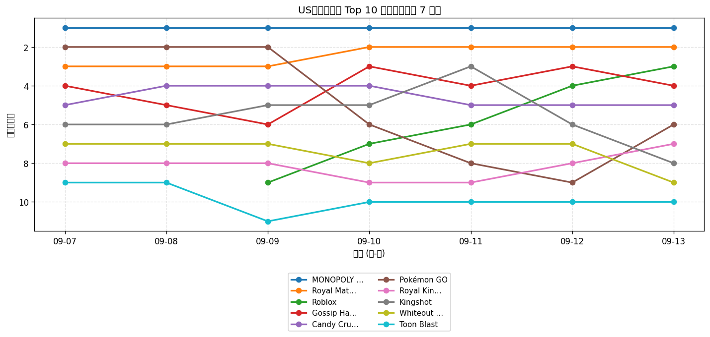
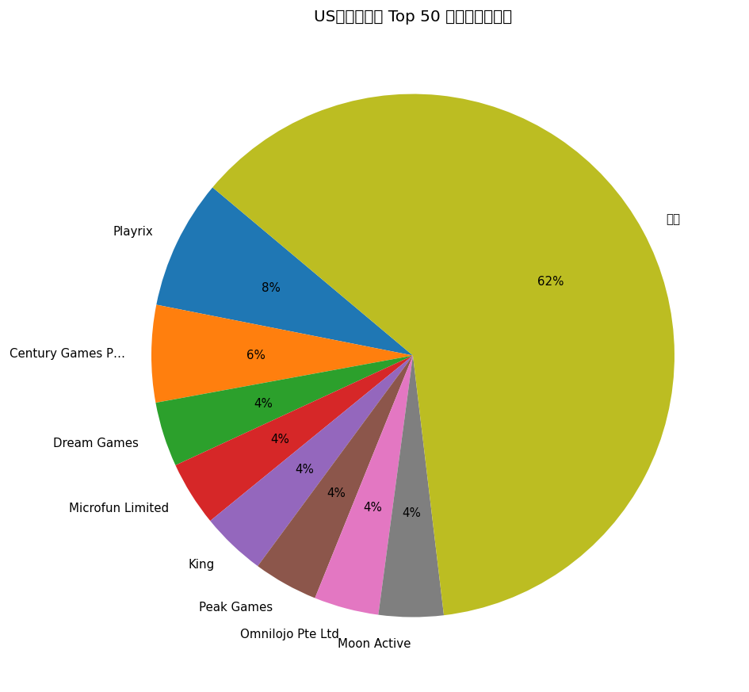
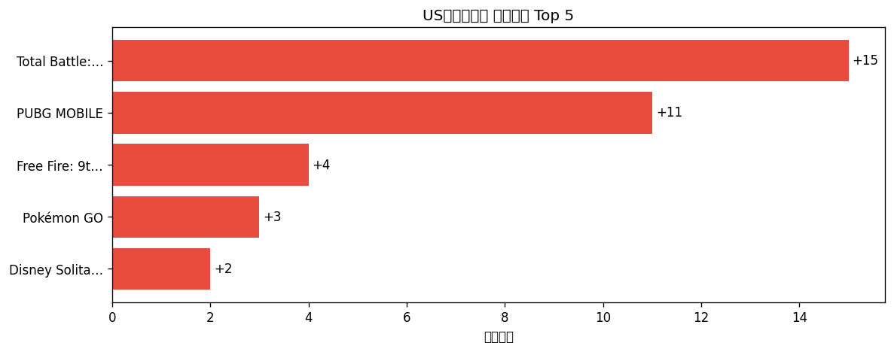

# 📊 游戏榜单日报 - 2026-09-13

**市场**：US　**榜单**：畅销游戏榜

## 📈 Top 10 排名趋势（近 7 天）

## 🏢 开发者席位占比

## 今日 Top 50

| 游戏榜排名 | 总榜排名 | 应用名称 | 开发者 |
| --- | --- | --- | --- |
| 1 | 6 | MONOPOLY GO! | Scopely, Inc. |
| 2 | 9 | Royal Match | Dream Games |
| 3 | 10 | Roblox | Roblox Corporation |
| 4 | 11 | Gossip Harbor®: Merge & Story | Microfun Limited |
| 5 | 15 | Candy Crush Saga | King |
| 6 | 24 | Pokémon GO | Scopely Explore, Inc. |
| 7 | 27 | Royal Kingdom | Dream Games |
| 8 | 29 | Kingshot | Century Games Pte. Ltd. |
| 9 | 31 | Whiteout Survival | Century Games Pte. Ltd. |
| 10 | 37 | Toon Blast | Peak Games |
| 11 | 43 | Township | Playrix |
| 12 | 46 | Free Fire: 9th Anniversary | GARENA INTERNATIONAL I PRIVATE LIMITED |
| 13 | 49 | Call of Duty®: Mobile | Activision Publishing, Inc. |
| 14 | 50 | Last War:Survival | FUNFLY PTE. LTD. |
| 15 | 51 | Match Factory! | Peak Games |
| 16 | 52 | Last Z: Survival Shooter | Omnilojo Pte Ltd |
| 17 | 53 | Gardenscapes | Playrix |
| 18 | 55 | Tasty Travels: Merge Game | Century Games Pte. Ltd. |
| 19 | 58 | Pixel Flow! | Loom Games Oyun Yazilim ve Pazarlama Anonim Sirketi |
| 20 | 61 | Coin Master | Moon Active |
| 21 | 66 | Total Battle: War Strategy | Scorewarrior |
| 22 | 68 | Honkai: Star Rail | COGNOSPHERE PTE. LTD. |
| 23 | 69 | Block Out! - Color Sort Puzzle | Grand Games A.Ş. |
| 24 | 72 | Homescapes: Match 3 Games | Playrix |
| 25 | 77 | Merge Cooking® | Happibits |
| 26 | 78 | Jelly Busters: Puzzle Game | Moon Active |
| 27 | 79 | Evony | TOP GAMES INC. |
| 28 | 80 | Fishdom | Playrix |
| 29 | 81 | EA SPORTS FC Soccer Mobile 26 | Electronic Arts |
| 30 | 82 | Jackpot Party - Casino Slots | Phantom EFX, Inc. |
| 31 | 86 | Magic Sort! | Grand Games A.Ş. |
| 32 | 90 | Screwdom | Zego Global Pte Ltd |
| 33 | 92 | Clash of Clans | Supercell |
| 34 | 95 | PUBG MOBILE | Tencent Mobile International Limited |
| 35 | 97 | NYT Games: Wordle & Crossword | The New York Times Company |
| 36 | 100 | Clash Royale | Supercell |
| 37 | - | Cashman Casino Slots Games | Product Madness |
| 38 | - | All in Hole: Black Hole Games | HOMA GAMES |
| 39 | - | Sword x Staff | Boltray Games |
| 40 | - | Lightning Link Casino Slots | Product Madness |
| 41 | - | Candy Crush Soda Saga | King |
| 42 | - | Disney Solitaire | SuperPlay |
| 43 | - | Colony Flow! | ABI GLOBAL LTD. |
| 44 | - | Pokémon TCG Pocket | The Pokemon Company |
| 45 | - | Yarn Loop: Knit Puzzle | Combo Games |
| 46 | - | Solitaire Associations Journey | Hitapps Games LTD |
| 47 | - | Dark War:Survival | Omnilojo Pte Ltd |
| 48 | - | Flambé®: Merge and Cook | Microfun Limited |
| 49 | - | Fortnite | Epic Games Inc. |
| 50 | - | Bus Traffic Fever! | GOODROID,Inc. |

## 🔥 上升最快 Top 5

| 应用名称 | 游戏榜变化 | 今日游戏榜排名 |
| --- | --- | --- |
| Total Battle: War Strategy | ↑15 (#36→#21) | #21 |
| PUBG MOBILE | ↑11 (#45→#34) | #34 |
| Free Fire: 9th Anniversary | ↑4 (#16→#12) | #12 |
| Pokémon GO | ↑3 (#9→#6) | #6 |
| Disney Solitaire | ↑2 (#44→#42) | #42 |

## 🆕 新入榜 Top 5

| 应用名称 | 游戏榜排名 | 总榜排名 | 开发者 |
| --- | --- | --- | --- |
| Honkai: Star Rail | #22 | 68 | COGNOSPHERE PTE. LTD. |
| Pokémon TCG Pocket | #44 | - | The Pokemon Company |
| Fortnite | #49 | - | Epic Games Inc. |
| Bus Traffic Fever! | #50 | - | GOODROID,Inc. |

## 📝 运营小结

今日US畅销游戏榜游戏榜由「MONOPOLY GO!」领跑（总榜 #6），「Total Battle: War Strategy」游戏榜上升 15 位（#36 → #21），值得关注；新入榜游戏包括 Honkai: Star Rail、Pokémon TCG Pocket、Fortnite 等，建议持续跟踪后续表现。
