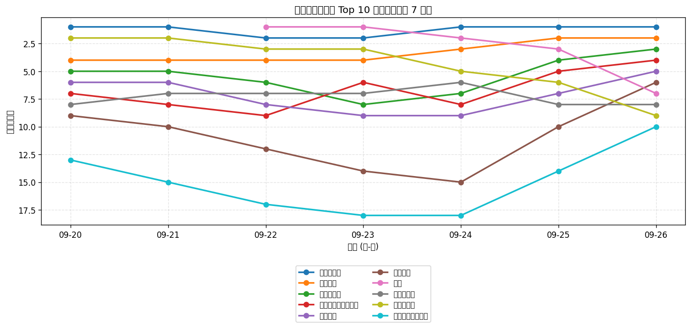
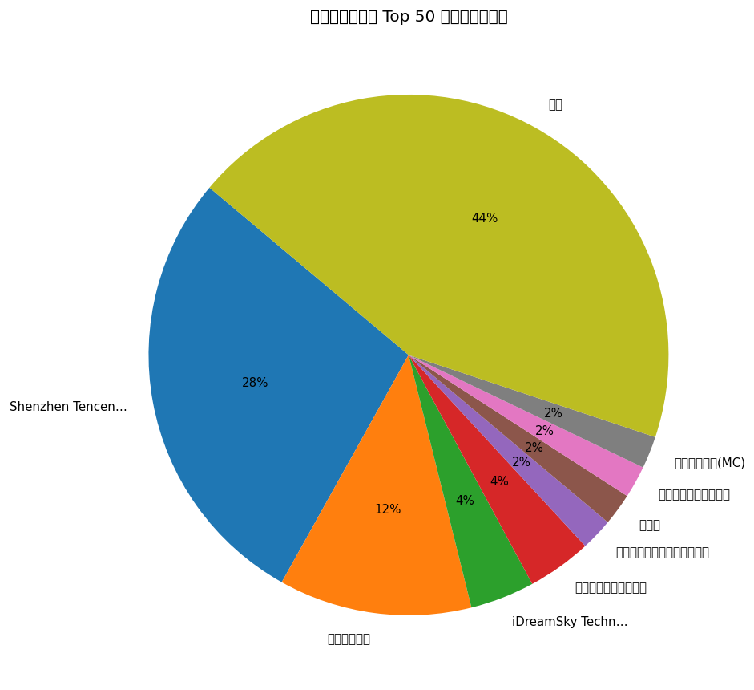
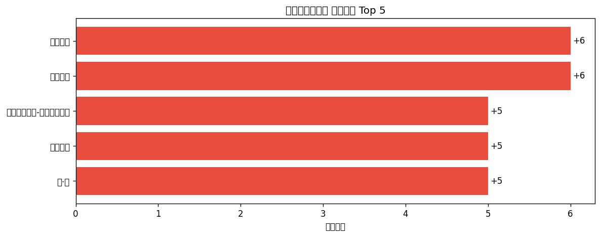

# 📊 游戏榜单日报 - 2026-09-26

**市场**：中国　**榜单**：免费游戏榜

## 📈 Top 10 排名趋势（近 7 天）

## 🏢 开发者席位占比

## 今日 Top 50

| 游戏榜排名 | 总榜排名 | 应用名称 | 开发者 |
| --- | --- | --- | --- |
| 1 | - | 王者万象棋 | Shenzhen Tencent Tianyou Technology Ltd |
| 2 | - | 王者荣耀 | Shenzhen Tencent Tianyou Technology Ltd |
| 3 | - | 三角洲行动 | Shenzhen Tencent Tianyou Technology Ltd |
| 4 | - | 无畏契约：源能行动 | Shenzhen Tencent Tianyou Technology Ltd |
| 5 | - | 和平精英 | Shenzhen Tencent Tianyou Technology Ltd |
| 6 | - | 蛋仔派对 | 网易移动游戏 |
| 7 | - | 伊莫 | 上海趣乐糖网络科技有限公司 |
| 8 | - | 开心消消乐 | 乐元素 |
| 9 | - | 弹壳战机！ | 北京猩球科技有限公司 |
| 10 | - | 我的世界：移动版 | 网易移动游戏(MC) |
| 11 | - | Dream Road: Online | Bellum Games LLC |
| 12 | - | 毛线大师 - 毛线消除游戏 疯狂毛线消不停 | Happy Bubble Information Technology Co., Ltd. |
| 13 | - | 金铲铲之战 | Shenzhen Tencent Tianyou Technology Ltd |
| 14 | - | 腾讯欢乐斗地主 | Shenzhen Tencent Tianyou Technology Ltd |
| 15 | - | 地铁跑酷 - 寻灵山海古都归来 | iDreamSky Technology Limited |
| 16 | - | 闪耀吧！噜咪 | Shanghai Hode Information Technology Co.,Ltd. |
| 17 | - | 火影忍者 | Shenzhen Tencent Tianyou Technology Ltd |
| 18 | - | 潮汐守望者 | Moonton Games |
| 19 | - | 迷你世界 | Miniwan Tech |
| 20 | - | 贪吃蛇大作战® | Wuhan Weipai Network Technology Co., Ltd. |
| 21 | - | 伯吉的温馨厨房 | 易美(深圳)网络科技发展有限公司 |
| 22 | - | 超自然行动组-登录送高泰明 | 巨人网络科技有限公司 |
| 23 | - | 天天爱数独-这关我不会数独大师 | 贺涛 周 |
| 24 | - | 植物大战僵尸2 | PopCap |
| 25 | - | 第五人格 | 网易移动游戏 |
| 26 | - | 疯狂水世界 | 益世界网络科技(上海)有限公司 |
| 27 | - | 光·遇 | 网易移动游戏 |
| 28 | - | 原神-6周年 | miHoYo Games |
| 29 | - | 英雄联盟手游 | Shenzhen Tencent Tianyou Technology Ltd |
| 30 | - | 燕云十六声 | 网易移动游戏 |
| 31 | - | QQ飞车 | Shenzhen Tencent Tianyou Technology Ltd |
| 32 | - | 穿越火线-枪战王者 | Shenzhen Tencent Tianyou Technology Ltd |
| 33 | - | 塔塔冒险队 | 上海莉莉丝计算机 |
| 34 | - | 古龙群侠录：自定义功法 | 杭州淞羽网络科技有限公司 |
| 35 | - | 离线游戏 - 不用网络的游戏 不联网游戏 | Matchstick Castle Technology Co.,Ltd. |
| 36 | - | 梦幻西游 | 网易移动游戏 |
| 37 | - | 汤姆猫跑酷-10周年第二弹猫拉松 | Outfit7 Limited |
| 38 | - | 欢乐麻将 | Tencent Mobile Games |
| 39 | - | 飞机大厨：空中烹饪 | Nordcurrent UAB |
| 40 | - | 神庙逃亡2 | iDreamSky Technology Limited |
| 41 | - | Phigros | Xiamen Pigeon Games Network Co., Ltd. |
| 42 | - | 暗区突围 | Shenzhen Tencent Tianyou Technology Ltd |
| 43 | - | 部落冲突（Clash of Clans） | Shenzhen Tencent Tianyou Technology Ltd |
| 44 | - | 巅峰极速 | 网易移动游戏 |
| 45 | - | 球球大作战 | 巨人网络科技有限公司 |
| 46 | - | 俱乐大玩家 | 光棱工作室 |
| 47 | - | JJ象棋-经典中国象棋游戏 | JJWorld(Beijing) Network Technology Company Limited |
| 48 | - | 心动小镇 | X.D. Network Inc. |
| 49 | - | 使命召唤手游 | Shenzhen Tencent Tianyou Technology Ltd |
| 50 | - | 元气骑士 | 泽阳 李 |

## 🔥 上升最快 Top 5

| 应用名称 | 游戏榜变化 | 今日游戏榜排名 |
| --- | --- | --- |
| 梦幻西游 | ↑6 (#42→#36) | #36 |
| 巅峰极速 | ↑6 (#50→#44) | #44 |
| 超自然行动组-登录送高泰明 | ↑5 (#27→#22) | #22 |
| 第五人格 | ↑5 (#30→#25) | #25 |
| 光·遇 | ↑5 (#32→#27) | #27 |

## 🆕 新入榜 Top 5

| 应用名称 | 游戏榜排名 | 总榜排名 | 开发者 |
| --- | --- | --- | --- |
| 伯吉的温馨厨房 | #21 | - | 易美(深圳)网络科技发展有限公司 |
| Phigros | #41 | - | Xiamen Pigeon Games Network Co., Ltd. |
| 心动小镇 | #48 | - | X.D. Network Inc. |
| 使命召唤手游 | #49 | - | Shenzhen Tencent Tianyou Technology Ltd |

## 📝 运营小结

今日中国免费游戏榜游戏榜由「王者万象棋」领跑（总榜 #-），「梦幻西游」游戏榜上升 6 位（#42 → #36），值得关注；新入榜游戏包括 伯吉的温馨厨房、Phigros、心动小镇 等，建议持续跟踪后续表现。
