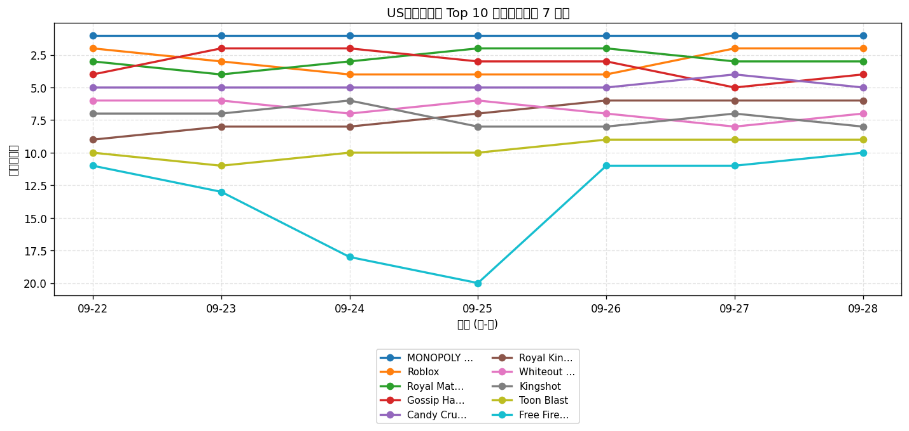
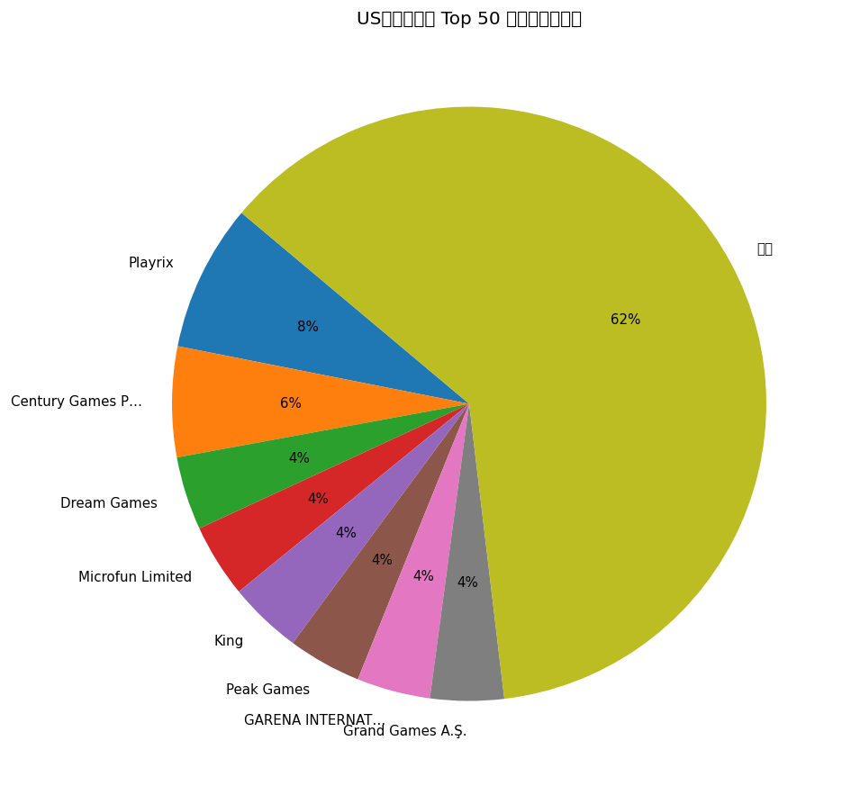
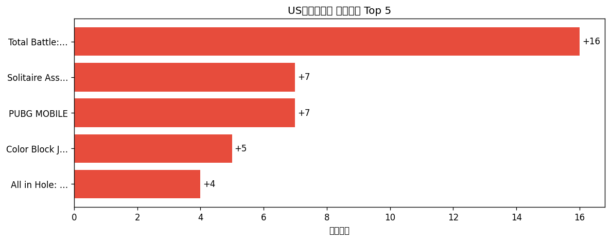

# 📊 游戏榜单日报 - 2026-09-28

**市场**：US　**榜单**：畅销游戏榜

## 📈 Top 10 排名趋势（近 7 天）

## 🏢 开发者席位占比

## 今日 Top 50

| 游戏榜排名 | 总榜排名 | 应用名称 | 开发者 |
| --- | --- | --- | --- |
| 1 | 4 | MONOPOLY GO! | Scopely, Inc. |
| 2 | 9 | Roblox | Roblox Corporation |
| 3 | 10 | Royal Match | Dream Games |
| 4 | 14 | Gossip Harbor®: Merge & Story | Microfun Limited |
| 5 | 15 | Candy Crush Saga | King |
| 6 | 27 | Royal Kingdom | Dream Games |
| 7 | 29 | Whiteout Survival | Century Games Pte. Ltd. |
| 8 | 32 | Kingshot | Century Games Pte. Ltd. |
| 9 | 37 | Toon Blast | Peak Games |
| 10 | 40 | Free Fire x NARUTO SHIPPUDEN | GARENA INTERNATIONAL I PRIVATE LIMITED |
| 11 | 46 | Pokémon GO | Scopely Explore, Inc. |
| 12 | 50 | Gardenscapes | Playrix |
| 13 | 53 | Match Factory! | Peak Games |
| 14 | 54 | Township | Playrix |
| 15 | 59 | Pixel Flow! | Loom Games Oyun Yazilim ve Pazarlama Anonim Sirketi |
| 16 | 60 | Tasty Travels: Merge Game | Century Games Pte. Ltd. |
| 17 | 61 | Total Battle: War Strategy | Scorewarrior |
| 18 | 62 | Last War:Survival | FUNFLY PTE. LTD. |
| 19 | 63 | Block Out! - Color Sort Puzzle | Grand Games A.Ş. |
| 20 | 64 | Last Z: Survival Shooter | Omnilojo Pte Ltd |
| 21 | 68 | Coin Master | Moon Active |
| 22 | 72 | Call of Duty®: Mobile | Activision Publishing, Inc. |
| 23 | 74 | Colony Flow! | ABI GLOBAL LTD. |
| 24 | 76 | Jelly Busters: Puzzle Game | Moon Active |
| 25 | 77 | Fishdom | Playrix |
| 26 | 78 | Homescapes: Match 3 Games | Playrix |
| 27 | 84 | Jackpot Party - Casino Slots | Phantom EFX, Inc. |
| 28 | 86 | Evony | TOP GAMES INC. |
| 29 | 87 | Screwdom | Zego Global Pte Ltd |
| 30 | 88 | Magic Sort! | Grand Games A.Ş. |
| 31 | 93 | Merge Cooking® | Happibits |
| 32 | 96 | EA SPORTS FC Soccer Mobile 27 | Electronic Arts |
| 33 | 98 | Lightning Link Casino Slots | Product Madness |
| 34 | 99 | NYT Games: Wordle & Crossword | The New York Times Company |
| 35 | - | All in Hole: Black Hole Games | HOMA GAMES |
| 36 | - | Bus Traffic Fever! | GOODROID,Inc. |
| 37 | - | Disney Solitaire | SuperPlay |
| 38 | - | Cashman Casino Slots Games | Product Madness |
| 39 | - | Candy Crush Soda Saga | King |
| 40 | - | Solitaire Associations Journey | Hitapps Games LTD |
| 41 | - | PUBG MOBILE | Tencent Mobile International Limited |
| 42 | - | Yarn Loop: Knit Puzzle | Combo Games |
| 43 | - | Sword x Staff | Boltray Games |
| 44 | - | Color Block Jam | Rollic Games |
| 45 | - | Free Fire MAX x NARUTO | GARENA INTERNATIONAL I PRIVATE LIMITED |
| 46 | - | Clash Royale | Supercell |
| 47 | - | Quick Hit Casino - Vegas Slots | Appchi Media Ltd |
| 48 | - | Fortnite | Epic Games Inc. |
| 49 | - | Clash of Clans | Supercell |
| 50 | - | Flambé®: Merge and Cook | Microfun Limited |

## 🔥 上升最快 Top 5

| 应用名称 | 游戏榜变化 | 今日游戏榜排名 |
| --- | --- | --- |
| Total Battle: War Strategy | ↑16 (#33→#17) | #17 |
| Solitaire Associations Journey | ↑7 (#47→#40) | #40 |
| PUBG MOBILE | ↑7 (#48→#41) | #41 |
| Color Block Jam | ↑5 (#49→#44) | #44 |
| All in Hole: Black Hole Games | ↑4 (#39→#35) | #35 |

## 🆕 新入榜 Top 5

| 应用名称 | 游戏榜排名 | 总榜排名 | 开发者 |
| --- | --- | --- | --- |
| Flambé®: Merge and Cook | #50 | - | Microfun Limited |

## 📝 运营小结

今日US畅销游戏榜游戏榜由「MONOPOLY GO!」领跑（总榜 #4），「Total Battle: War Strategy」游戏榜上升 16 位（#33 → #17），值得关注；新入榜游戏包括 Flambé®: Merge and Cook 等，建议持续跟踪后续表现。
