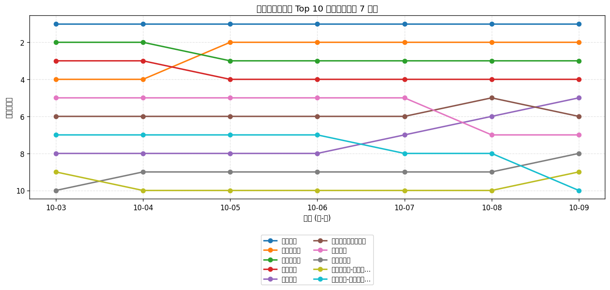
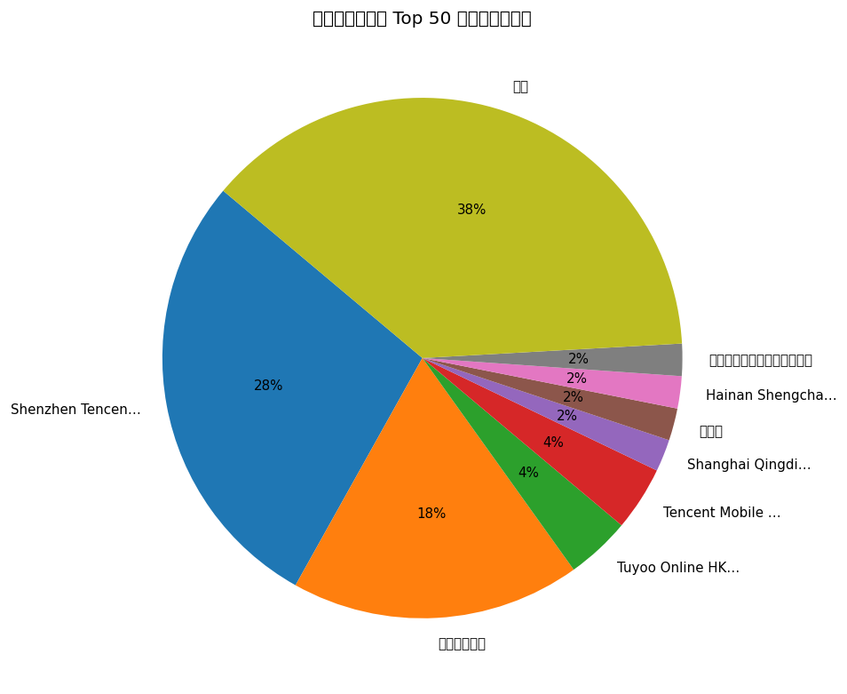
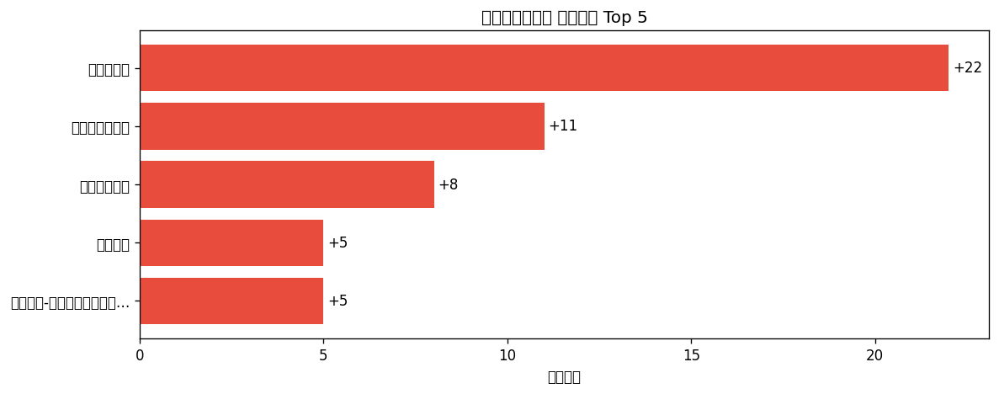

# 📊 游戏榜单日报 - 2026-10-09

**市场**：中国　**榜单**：畅销游戏榜

## 📈 Top 10 排名趋势（近 7 天）

## 🏢 开发者席位占比

## 今日 Top 50

| 游戏榜排名 | 总榜排名 | 应用名称 | 开发者 |
| --- | --- | --- | --- |
| 1 | 2 | 王者荣耀 | Shenzhen Tencent Tianyou Technology Ltd |
| 2 | 6 | 三角洲行动 | Shenzhen Tencent Tianyou Technology Ltd |
| 3 | 10 | 金铲铲之战 | Shenzhen Tencent Tianyou Technology Ltd |
| 4 | 14 | 和平精英 | Shenzhen Tencent Tianyou Technology Ltd |
| 5 | 17 | 梦幻西游 | 网易移动游戏 |
| 6 | 19 | 无畏契约：源能行动 | Shenzhen Tencent Tianyou Technology Ltd |
| 7 | 20 | 无尽冬日 | Shanghai Qingdi Technology Company Limited |
| 8 | 23 | 开心消消乐 | 乐元素 |
| 9 | 24 | 捕鱼大作战-街机打鱼游戏王者 | Tuyoo Online HK Limited |
| 10 | 28 | 蛋仔派对-小猪佩奇联动 | 网易移动游戏 |
| 11 | 29 | 火影忍者 | Shenzhen Tencent Tianyou Technology Ltd |
| 12 | 31 | 王者万象棋 | Shenzhen Tencent Tianyou Technology Ltd |
| 13 | 32 | 向僵尸开炮-尸潮来袭 | Hainan Shengchang Network Technology Co., Ltd. |
| 14 | 33 | 时尚百货城 | 深圳市爱的番茄科技有限公司 |
| 15 | 34 | 原神-6周年 | miHoYo Games |
| 16 | 35 | 塔塔冒险队 | 上海莉莉丝计算机 |
| 17 | 38 | 腾讯欢乐斗地主 | Shenzhen Tencent Tianyou Technology Ltd |
| 18 | 42 | 英雄联盟手游 | Shenzhen Tencent Tianyou Technology Ltd |
| 19 | 44 | FC足球世界-Next | Tencent Mobile Games |
| 20 | 45 | 三国志·战略版 | Lingxi Games Inc. |
| 21 | 46 | 捕鱼大咖-畅爽3D街机捕鱼游戏 | 游酷盛世科技(北京)有限公司 |
| 22 | 47 | 多乐够级 | Beijing Pengqu Technology Co.,Ltd. |
| 23 | 52 | 指尖四川麻将 | Shenzhen Zen-Game Technology CO.,LTD |
| 24 | 53 | 部落冲突（Clash of Clans） | Shenzhen Tencent Tianyou Technology Ltd |
| 25 | 54 | 鱼乐达人-王者捕鱼电玩街机打鱼游戏 | CoolPlus Software (HongKong) Limited |
| 26 | 55 | 实况足球 | 网易移动游戏 |
| 27 | 57 | 途游休闲捕鱼-百万倍街机王者大作战 | TYSG Games |
| 28 | 58 | 超自然行动组-送联动皮肤 | 巨人网络科技有限公司 |
| 29 | 59 | 穿越火线-枪战王者 | Shenzhen Tencent Tianyou Technology Ltd |
| 30 | 61 | 疯狂水世界 | 益世界网络科技(上海)有限公司 |
| 31 | 62 | 奔奔王国 | Fuzhou Dian Dian Song He Technology Co., Ltd |
| 32 | 63 | 洛克王国：世界 | Shenzhen Tencent Tianyou Technology Ltd |
| 33 | 64 | 我的花园世界 | 厦门麟贝互娱科技有限公司 |
| 34 | 65 | 第五人格 | 网易移动游戏 |
| 35 | 66 | 率土之滨 | 网易移动游戏 |
| 36 | 67 | 地下城与勇士：起源 | Tencent Mobile Games |
| 37 | 68 | 永远的蔚蓝星球-周杰伦代言 | Songyue Joy |
| 38 | 69 | 途游斗地主（比赛版） | Tuyoo Online HK Limited |
| 39 | 72 | 三国：冰河时代 | EVISTA PTE. LTD. |
| 40 | 73 | 暗区突围 | Shenzhen Tencent Tianyou Technology Ltd |
| 41 | 76 | QQ飞车 | Shenzhen Tencent Tianyou Technology Ltd |
| 42 | 79 | 恋与深空 | Paper Games |
| 43 | 80 | 竞技联盟德州扑克 | Sohoo Limited |
| 44 | 81 | 最佳球会-全新赛季版本 | Gala Sports Technology Limited |
| 45 | 84 | 大话西游 | 网易移动游戏 |
| 46 | 86 | 梦幻花园 - Gardenscapes | Beijing Wei Wo Le Yuan Information and Technology Co., Ltd |
| 47 | 89 | 逆水寒 | 网易移动游戏 |
| 48 | 91 | 三国杀 | 杭州游卡网络技术有限公司 |
| 49 | 92 | 阴阳师 - 十周年送十连十金 | 网易移动游戏 |
| 50 | 93 | 燕云十六声 | 网易移动游戏 |

## 🔥 上升最快 Top 5

| 应用名称 | 游戏榜变化 | 今日游戏榜排名 |
| --- | --- | --- |
| 塔塔冒险队 | ↑22 (#38→#16) | #16 |
| 洛克王国：世界 | ↑11 (#43→#32) | #32 |
| 指尖四川麻将 | ↑8 (#31→#23) | #23 |
| 多乐够级 | ↑5 (#27→#22) | #22 |
| 鱼乐达人-王者捕鱼电玩街机打鱼游戏 | ↑5 (#30→#25) | #25 |

## 🆕 新入榜 Top 5

| 应用名称 | 游戏榜排名 | 总榜排名 | 开发者 |
| --- | --- | --- | --- |
| 大话西游 | #45 | 84 | 网易移动游戏 |
| 逆水寒 | #47 | 89 | 网易移动游戏 |
| 燕云十六声 | #50 | 93 | 网易移动游戏 |

## 📝 运营小结

今日中国畅销游戏榜游戏榜由「王者荣耀」领跑（总榜 #2），「塔塔冒险队」游戏榜上升 22 位（#38 → #16），值得关注；新入榜游戏包括 大话西游、逆水寒、燕云十六声 等，建议持续跟踪后续表现。
