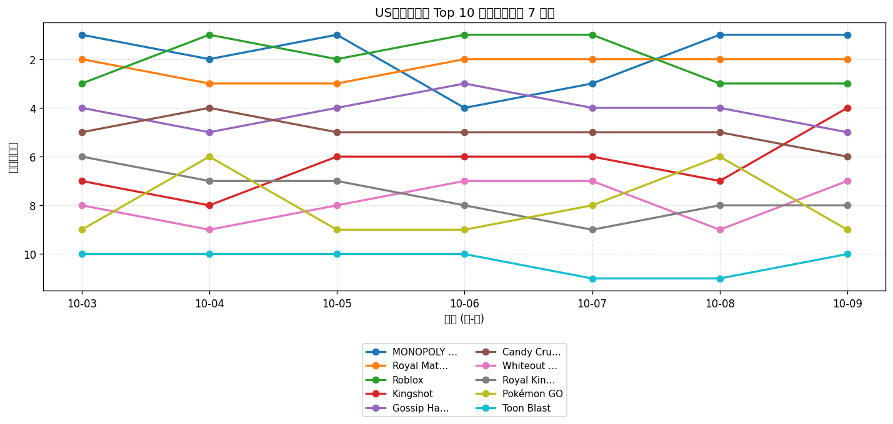
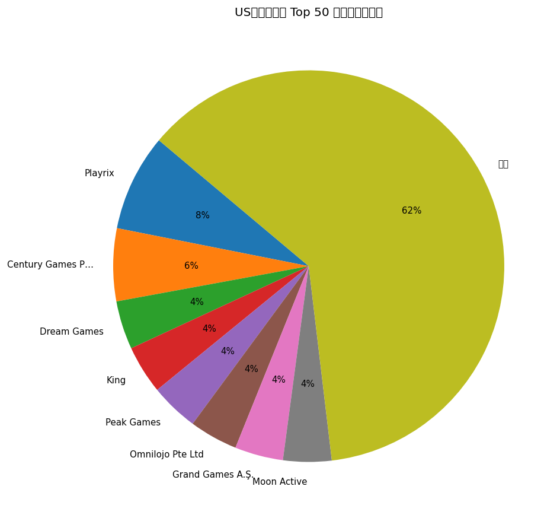
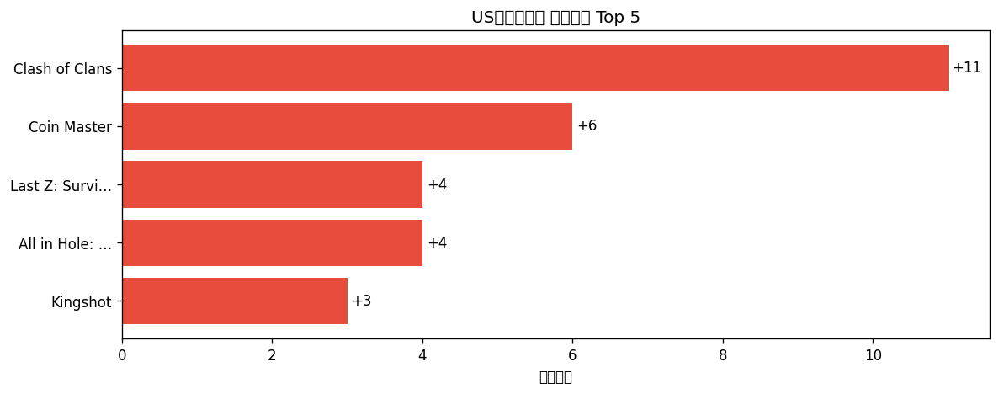

# 📊 游戏榜单日报 - 2026-10-09

**市场**：US　**榜单**：畅销游戏榜

## 📈 Top 10 排名趋势（近 7 天）

## 🏢 开发者席位占比

## 今日 Top 50

| 游戏榜排名 | 总榜排名 | 应用名称 | 开发者 |
| --- | --- | --- | --- |
| 1 | 10 | MONOPOLY GO! | Scopely, Inc. |
| 2 | 12 | Royal Match | Dream Games |
| 3 | 13 | Roblox | Roblox Corporation |
| 4 | 16 | Kingshot | Century Games Pte. Ltd. |
| 5 | 19 | Gossip Harbor®: Merge & Story | Microfun Limited |
| 6 | 22 | Candy Crush Saga | King |
| 7 | 25 | Whiteout Survival | Century Games Pte. Ltd. |
| 8 | 30 | Royal Kingdom | Dream Games |
| 9 | 33 | Pokémon GO | Scopely Explore, Inc. |
| 10 | 39 | Toon Blast | Peak Games |
| 11 | 44 | Last Z: Survival Shooter | Omnilojo Pte Ltd |
| 12 | 48 | Last War:Survival | FUNFLY PTE. LTD. |
| 13 | 52 | Match Factory! | Peak Games |
| 14 | 56 | Tasty Travels: Merge Game | Century Games Pte. Ltd. |
| 15 | 57 | Township | Playrix |
| 16 | 60 | Gardenscapes | Playrix |
| 17 | 61 | Block Out! - Color Sort Puzzle | Grand Games A.Ş. |
| 18 | 63 | Colony Flow! | ABI GLOBAL LTD. |
| 19 | 64 | Free Fire x NARUTO SHIPPUDEN | GARENA INTERNATIONAL I PRIVATE LIMITED |
| 20 | 66 | Pixel Flow! | Loom Games Oyun Yazilim ve Pazarlama Anonim Sirketi |
| 21 | 74 | Coin Master | Moon Active |
| 22 | 76 | Clash of Clans | Supercell |
| 23 | 77 | Jelly Busters: Puzzle Game | Moon Active |
| 24 | 78 | Homescapes | Playrix |
| 25 | 79 | Fishdom | Playrix |
| 26 | 83 | Total Battle: War Strategy | Scorewarrior |
| 27 | 84 | EA SPORTS FC Soccer Mobile 27 | Electronic Arts |
| 28 | 85 | Lightning Link Casino Slots | Product Madness |
| 29 | 90 | Screwdom | Zego Global Pte Ltd |
| 30 | 92 | Merge Cooking® | Happibits |
| 31 | 94 | Magic Sort! | Grand Games A.Ş. |
| 32 | 96 | Jackpot Party - Casino Slots | Phantom EFX, Inc. |
| 33 | 97 | Cashman Casino Slots Games | Product Madness |
| 34 | 100 | Bus Traffic Fever! | GOODROID,Inc. |
| 35 | - | Clash Royale | Supercell |
| 36 | - | Disney Solitaire | SuperPlay |
| 37 | - | NYT Games: Wordle & Crossword | The New York Times Company |
| 38 | - | DRAGON BALL LEGENDS | Bandai Namco Entertainment Inc. |
| 39 | - | All in Hole: Black Hole Games | HOMA GAMES |
| 40 | - | Yarn Loop: Knit Puzzle | Combo Games |
| 41 | - | Color Block Jam | Rollic Games |
| 42 | - | Solitaire Associations Journey | Hitapps Games LTD |
| 43 | - | Pokémon TCG Pocket | The Pokemon Company |
| 44 | - | Call of Duty®: Mobile | Activision Publishing, Inc. |
| 45 | - | Dark War:Survival | Omnilojo Pte Ltd |
| 46 | - | Sword x Staff | Boltray Games |
| 47 | - | PUBG MOBILE | Tencent Mobile International Limited |
| 48 | - | Candy Crush Soda Saga | King |
| 49 | - | Fortnite | Epic Games Inc. |
| 50 | - | DRAGON BALL Z DOKKAN BATTLE | Bandai Namco Entertainment Inc. |

## 🔥 上升最快 Top 5

| 应用名称 | 游戏榜变化 | 今日游戏榜排名 |
| --- | --- | --- |
| Clash of Clans | ↑11 (#33→#22) | #22 |
| Coin Master | ↑6 (#27→#21) | #21 |
| Last Z: Survival Shooter | ↑4 (#15→#11) | #11 |
| All in Hole: Black Hole Games | ↑4 (#43→#39) | #39 |
| Kingshot | ↑3 (#7→#4) | #4 |

## 🆕 新入榜 Top 5

| 应用名称 | 游戏榜排名 | 总榜排名 | 开发者 |
| --- | --- | --- | --- |
| EA SPORTS FC Soccer Mobile 27 | #27 | 84 | Electronic Arts |
| PUBG MOBILE | #47 | - | Tencent Mobile International Limited |
| Fortnite | #49 | - | Epic Games Inc. |

## 📝 运营小结

今日US畅销游戏榜游戏榜由「MONOPOLY GO!」领跑（总榜 #10），「Clash of Clans」游戏榜上升 11 位（#33 → #22），值得关注；新入榜游戏包括 EA SPORTS FC Soccer Mobile 27、PUBG MOBILE、Fortnite 等，建议持续跟踪后续表现。
