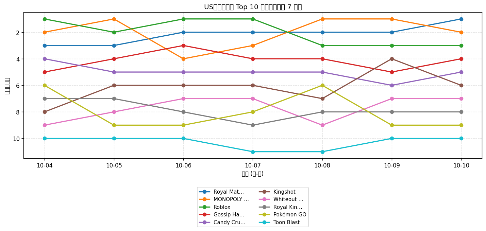
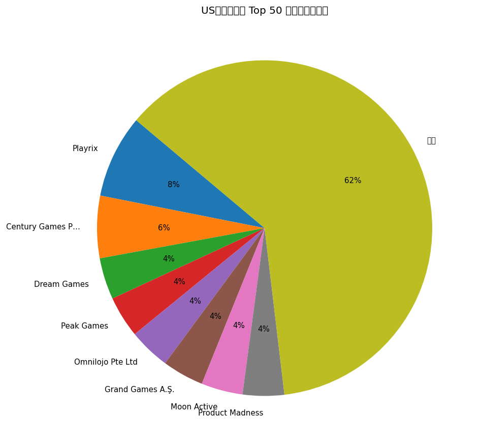
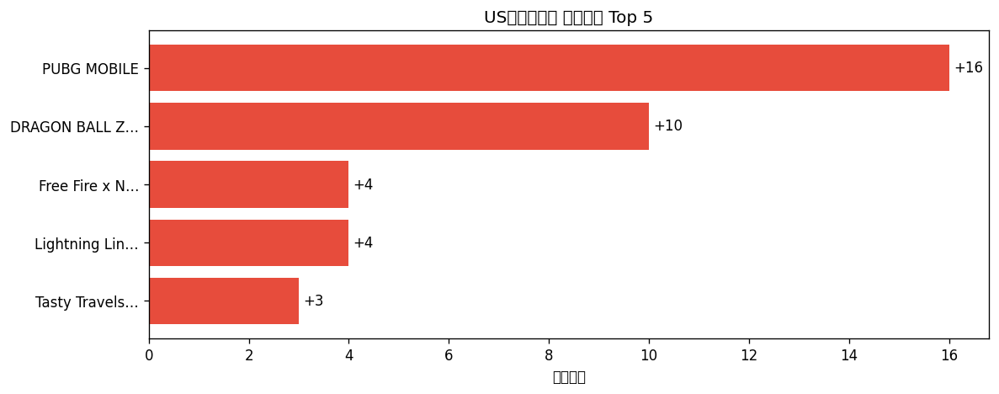

# 📊 游戏榜单日报 - 2026-10-10

**市场**：US　**榜单**：畅销游戏榜

## 📈 Top 10 排名趋势（近 7 天）

## 🏢 开发者席位占比

## 今日 Top 50

| 游戏榜排名 | 总榜排名 | 应用名称 | 开发者 |
| --- | --- | --- | --- |
| 1 | 10 | Royal Match | Dream Games |
| 2 | 11 | MONOPOLY GO! | Scopely, Inc. |
| 3 | 12 | Roblox | Roblox Corporation |
| 4 | 16 | Gossip Harbor®: Merge & Story | Microfun Limited |
| 5 | 19 | Candy Crush Saga | King |
| 6 | 25 | Kingshot | Century Games Pte. Ltd. |
| 7 | 26 | Whiteout Survival | Century Games Pte. Ltd. |
| 8 | 29 | Royal Kingdom | Dream Games |
| 9 | 39 | Pokémon GO | Scopely Explore, Inc. |
| 10 | 40 | Toon Blast | Peak Games |
| 11 | 46 | Tasty Travels: Merge Game | Century Games Pte. Ltd. |
| 12 | 48 | Last War:Survival | FUNFLY PTE. LTD. |
| 13 | 50 | Match Factory! | Peak Games |
| 14 | 51 | Last Z: Survival Shooter | Omnilojo Pte Ltd |
| 15 | 54 | Free Fire x NARUTO SHIPPUDEN | GARENA INTERNATIONAL I PRIVATE LIMITED |
| 16 | 56 | Gardenscapes | Playrix |
| 17 | 58 | Township | Playrix |
| 18 | 60 | Block Out! - Color Sort Puzzle | Grand Games A.Ş. |
| 19 | 63 | Colony Flow! | ABI GLOBAL LTD. |
| 20 | 64 | Pixel Flow! | Loom Games Oyun Yazilim ve Pazarlama Anonim Sirketi |
| 21 | 65 | Coin Master | Moon Active |
| 22 | 71 | Homescapes | Playrix |
| 23 | 76 | Evony | TOP GAMES INC. |
| 24 | 77 | Lightning Link Casino Slots | Product Madness |
| 25 | 80 | Fishdom | Playrix |
| 26 | 81 | Merge Mansion: Puzzles & Story | Metacore Games Oy |
| 27 | 82 | Jelly Busters: Puzzle Game | Moon Active |
| 28 | 83 | Merge Cooking® | Happibits |
| 29 | 89 | Clash of Clans | Supercell |
| 30 | 91 | Total Battle: War Strategy | Scorewarrior |
| 31 | 93 | PUBG MOBILE | Tencent Mobile International Limited |
| 32 | 94 | Screwdom | Zego Global Pte Ltd |
| 33 | 95 | Magic Sort! | Grand Games A.Ş. |
| 34 | 96 | EA SPORTS FC Soccer Mobile 27 | Electronic Arts |
| 35 | 97 | Jackpot Party - Casino Slots | Phantom EFX, Inc. |
| 36 | - | Cashman Casino Slots Games | Product Madness |
| 37 | - | Mobile Legends: Bang Bang.US | Skystone Games Pte. Ltd. |
| 38 | - | Bus Traffic Fever! | GOODROID,Inc. |
| 39 | - | Disney Solitaire | SuperPlay |
| 40 | - | DRAGON BALL Z DOKKAN BATTLE | Bandai Namco Entertainment Inc. |
| 41 | - | Clash Royale | Supercell |
| 42 | - | NYT Games: Wordle & Crossword | The New York Times Company |
| 43 | - | Call of Duty®: Mobile | Activision Publishing, Inc. |
| 44 | - | All in Hole: Black Hole Games | HOMA GAMES |
| 45 | - | Yarn Loop: Knit Puzzle | Combo Games |
| 46 | - | Fortnite | Epic Games Inc. |
| 47 | - | Sword x Staff | Boltray Games |
| 48 | - | Dark War:Survival | Omnilojo Pte Ltd |
| 49 | - | Color Block Jam | Rollic Games |
| 50 | - | Pokémon TCG Pocket | The Pokemon Company |

## 🔥 上升最快 Top 5

| 应用名称 | 游戏榜变化 | 今日游戏榜排名 |
| --- | --- | --- |
| PUBG MOBILE | ↑16 (#47→#31) | #31 |
| DRAGON BALL Z DOKKAN BATTLE | ↑10 (#50→#40) | #40 |
| Free Fire x NARUTO SHIPPUDEN | ↑4 (#19→#15) | #15 |
| Lightning Link Casino Slots | ↑4 (#28→#24) | #24 |
| Tasty Travels: Merge Game | ↑3 (#14→#11) | #11 |

## 🆕 新入榜 Top 5

| 应用名称 | 游戏榜排名 | 总榜排名 | 开发者 |
| --- | --- | --- | --- |
| Evony | #23 | 76 | TOP GAMES INC. |
| Merge Mansion: Puzzles & Story | #26 | 81 | Metacore Games Oy |
| Mobile Legends: Bang Bang.US | #37 | - | Skystone Games Pte. Ltd. |

## 📝 运营小结

今日US畅销游戏榜游戏榜由「Royal Match」领跑（总榜 #10），「PUBG MOBILE」游戏榜上升 16 位（#47 → #31），值得关注；新入榜游戏包括 Evony、Merge Mansion: Puzzles & Story、Mobile Legends: Bang Bang.US 等，建议持续跟踪后续表现。
